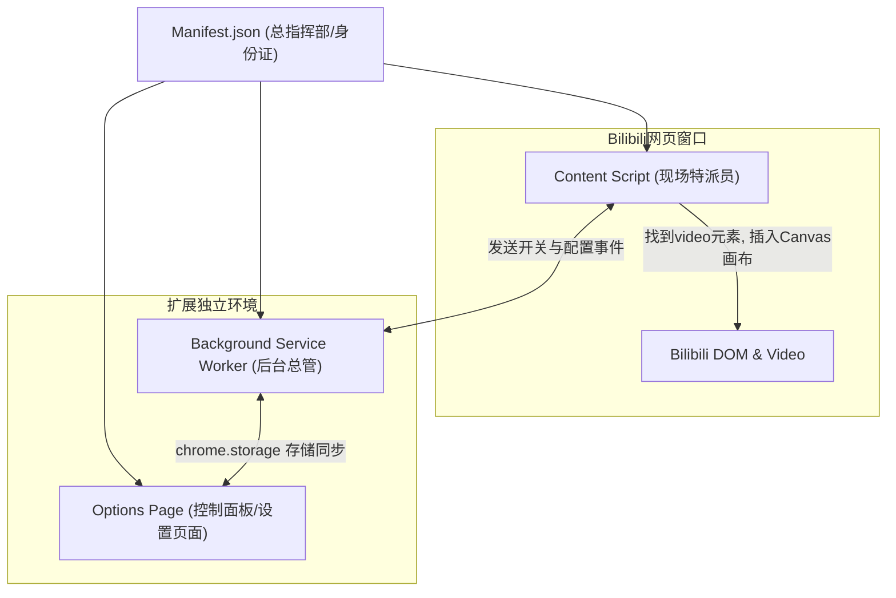
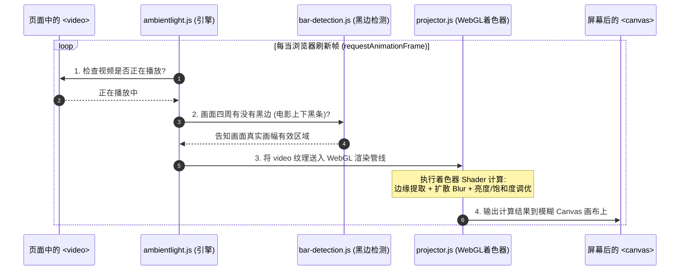

# Bilibili Ambilight 源码架构与核心原理解析

这是一份专为**前端初学者**编写的项目解析指南。本文将跳过复杂的工业级封装细节，用最通俗易懂的语言、类比与图解，带你了解这个浏览器扩展是如何运作的。

---

## 目录
1. [这个插件在做什么？（现实类比）](#1-这个插件在做什么现实类比)
2. [浏览器扩展的基本架构（三个平行世界）](#2-浏览器扩展的基本架构三个平行世界)
3. [项目文件目录结构地图](#3-项目文件目录结构地图)
4. [流光效果的核心技术实现（四步渲染循环）](#4-流光效果的核心技术实现四步渲染循环)
5. [关键模块逐个拆解](#5-关键模块逐个拆解)
6. [初学者进阶学习建议](#6-初学者进阶学习建议)

---

## 1. 这个插件在做什么？（现实类比）

想象你在漆黑的客厅里看电视：
- **普通视频**：电视屏幕亮起，屏幕之外是一圈冷冰冰的黑边或者墙壁。
- **流光溢彩（Ambilight）**：在电视机背部贴上一圈 RGB 灯带，灯光会**实时根据电视画面边缘的颜色变幻**。如果屏幕左侧是一片绿草地，左侧墙面就泛起柔和的绿光；如果右侧是夕阳，右侧墙壁就泛起暖黄的余晕。

**本项目在网页中的实现方式**：
通过 JavaScript 在 Bilibili 播放器的底层插入一个看不见的画布（`<canvas>`），实时抓取 `<video>` 视频标签当前帧的画面，用显卡 GPU（WebGL）进行模糊与发光扩散计算，铺在播放器后方，形成身临其境的氛围光效。

---

## 2. 浏览器扩展的基本架构（三个平行世界）

Chrome 扩展有一套专属的运行机制。你可以把这个插件理解为由 **三个不同职责的“工作部门”** 组成的：



### ① 身份证：`manifest.json`
- 告诉浏览器：“我是谁、我有哪些权限、我在访问哪些网址（如 `bilibili.com/video/*`）时需要出动”。

### ② 现场特派员：`content.js`（内容脚本）
- **特点**：直接驻扎在 Bilibili 视频页面里。
- **职责**：它可以操作网页的 DOM 结构，负责找到页面里的 `<video>` 标签，把我们计算好的流光画布插入到播放器后面。

### ③ 网页全局运行：`injected.js`（注入脚本）
- 因为普通 `content.js` 受浏览器安全沙箱隔离限制，无法直接读取 Bilibili 原生播放器挂载在 `window` 上的内部全局变量；因此通过向页面注入一个脚本，获取更底层的播放器状态。

### ④ 控制面板：`options.html` + `options.js`
- 就是点击插件图标弹出的配置界面。初学者熟悉的经典 HTML + CSS + JS：滑动条、开关按钮、快捷键配置。修改后将配置保存在浏览器的 `chrome.storage.local` 中。

---

## 3. 项目文件目录结构地图

项目的源码都在 `src/` 目录下，以下是最核心的文件结构：

```
bilibili-ambilight/
├── dist/                     # 编译打包输出目录（加载解压插件时选这个目录）
├── releases/                 # 打包好的 .crx 安装包与 .zip 文件
├── src/                      # 核心源码
│   ├── manifest.json         # 扩展配置文件
│   ├── options.html          # 设置页面的 HTML 结构
│   ├── styles/               # 样式表 (Sass/SCSS)
│   │   ├── content.scss      # 注入到 Bilibili 页面的样式（控制画布层级、全屏适配、overflow防溢出等）
│   │   └── options.css       # 设置面板的高级极简 UI 样式
│   └── scripts/
│       ├── background.js     # 后台服务工作者（生命周期、版本更新提示）
│       ├── content.js        # 网页注入入口点（初始化流光引擎）
│       ├── injected.js       # 注入到 Bilibili 原生上下文的脚本
│       ├── options.js        # 设置面板的交互逻辑（滑块事件、重置、存储读取）
│       └── libs/             # ⭐️ 核心功能库
│           ├── ambientlight.js # 【大脑】流光主引擎，控制帧循环与生命周期
│           ├── projector.js    # 【画师】负责用 WebGL / 2D Canvas 绘制光效
│           ├── bar-detection.js# 【探针】自动黑边检测（避免黑边导致周围光线熄灭）
│           ├── settings.js     # 负责读取和同步用户在设置页存的配置
│           └── settings-config.js # 所有 12 个可调配置的默认值与说明
├── pack.js                   # 一键打包 .crx 的 Node.js 脚本
└── package.json              # 项目依赖与编译脚本
```

---

## 4. 流光效果的核心技术实现（四步渲染循环）

流光溢彩能在 60 帧下流畅运行，核心在于一个类似**游戏渲染引擎**的持续循环（Loop）：



### 步骤详细剖析：

1. **`requestAnimationFrame(render)`（帧循环）**：
   - 这是前端做高性能动画的标准 API。浏览器每刷新一帧（例如每秒 60 次），就调用一次我们的渲染函数，比普通的 `setInterval` 更加平滑且绝不掉帧。

2. **黑边识别（Black Bar Detection）**：
   - 很多视频由于比例问题（如 21:9 宽银幕电影），画面上下会有两条黑边。如果直接对整个视频抽色，边缘全是黑色，流光就会熄灭。
   - `bar-detection.js` 会对视频边缘采样几组像素，计算出实际有效画面的边界（裁剪掉黑边），确保采样的是真实的色彩。

3. **GPU 加速绘制（WebGL Shaders）**：
   - 如果用 CPU 一个个像素去算高斯模糊，电脑 CPU 占用率会很高。
   - 项目在 `projector.js` 中使用 **WebGL**。把视频的一帧当作一张“贴图”（Texture），交由显卡着色器（Fragment Shader）在几微秒内完成模糊、扩散（Spread）、对比度和饱和度的数学变换。

---

## 5. 关键模块逐个拆解

### 模块 A：`src/scripts/options.js`（设置界面交互）
初学者最容易看懂的文件。它的主要逻辑：
- **监听用户拖动滑块**：
  ```javascript
  // 简化的概念代码
  slider.addEventListener('input', (e) => {
    const value = e.target.value;
    // 1. 实时修改页面显示的数字 (如 120%)
    valueLabel.textContent = `${value}%`;
    // 2. 存入浏览器本地数据库
    chrome.storage.local.set({ [settingKey]: value });
  });
  ```
- **快捷键录制**：监听 `keydown` 事件，阻止浏览器默认行为，捕获用户按下的按键（如我们配置的 `L` 键）并保存。

### 模块 B：`src/scripts/libs/ambientlight.js`（核心调度器）
它是整个项目的控制中枢，负责：
- 监听 Bilibili 网页上的视频播放器状态变化：
  - 视频暂停（`pause`）时停止循环，节省电量与性能；
  - 视频播放（`play`）时唤醒循环；
  - 网页全屏（`fullscreenchange`）时重新适配画布宽高与全屏样式。
- 防止横向滚动条问题（通过动态挂载 CSS 约束 `overflow-x: clip`）。

---

## 6. 初学者进阶学习建议

如果你想借由这个项目深化自己的前端功力，推荐按以下次序研究代码：

1. **第一阶段（入门 UI 与存储）**：
   - 研读 `src/options.html` 和 `src/scripts/options.js`。
   - 学习现代 CSS（变量 `var(--...)`、Flexbox、Grid 布局、毛玻璃效果）。
   - 学习 Chrome 的异步存储 API：`chrome.storage.local.get()` 与 `set()`。

2. **第二阶段（DOM 操作与事件监听）**：
   - 研读 `src/scripts/content.js`。
   - 观察它是如何利用 `MutationObserver` 监听 Bilibili 异步加载出的视频元素。

3. **第三阶段（高性能图像处理，高阶）**：
   - 了解 HTML5 `<canvas>` 的基础 `drawImage(video, ...)` API。
   - 了解 WebGL 与 GLSL 着色器是如何利用显卡并行计算图形模糊与发光的。
